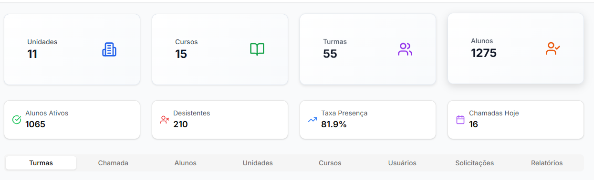
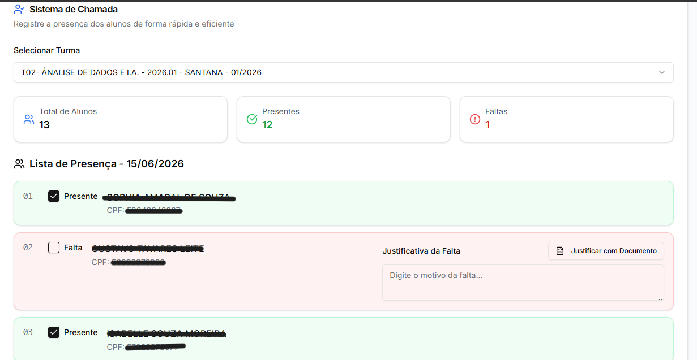
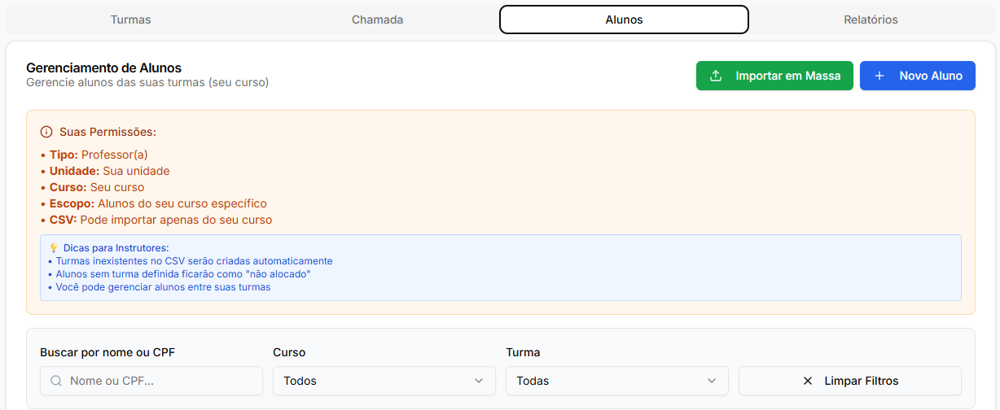
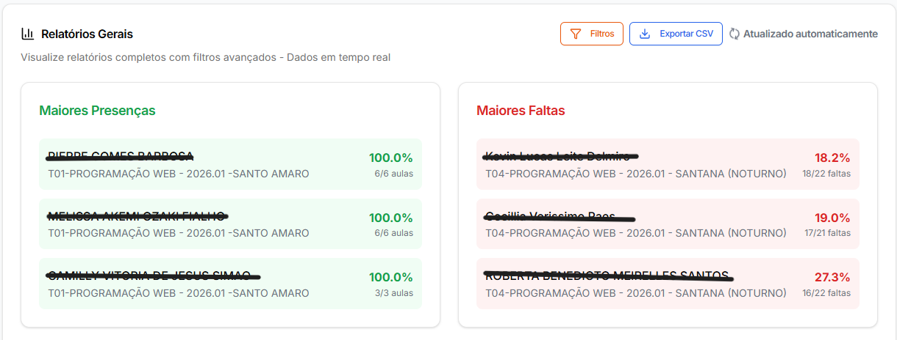
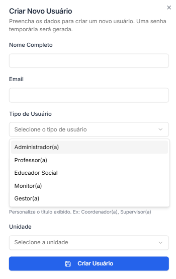

# ClassCheck — Sistema de Controle de Presença e Análise de Evasão

> Plataforma desenvolvida para o **Instituto da Oportunidade Social (IOS) / Percorre** com o objetivo de digitalizar o controle de frequência de alunos, identificar padrões de evasão e apoiar decisões pedagógicas com dados reais.

---

## Impacto e Escala

| | |
|---|---|
| **Ambiente** | Produção real — não é projeto acadêmico |
| **Abrangência** | 5 estados brasileiros: SP · MG · RS · RJ · PE |
| **Início do desenvolvimento** | 2024 |
| **Implantação em produção** | 1º semestre de 2026 |
| **Substituiu** | Planilhas e registros manuais fragmentados por um único sistema centralizado |
| **Usuários** | Instrutores, pedagogos, coordenadores e gestores em múltiplas unidades |

---

## O Problema

Antes do ClassCheck, o controle de presença no IOS era feito manualmente — planilhas, papéis e registros descentralizados. Isso tornava impossível:

- Saber em tempo real quantos alunos estavam evadindo
- Identificar **em qual período do semestre** a evasão era mais crítica
- Entender **por que** alunos abandonavam o curso (transporte? renda? localização?)
- Agir preventivamente antes que o aluno desistisse

A instituição precisava de um sistema que transformasse chamada diária em inteligência pedagógica.

---

## Minha Atuação

Este projeto foi concebido, projetado, desenvolvido e implantado por mim de forma independente.

**Fui responsável por:**

- **Levantamento de requisitos** — entrevistas com instrutores, pedagogos e gestores para mapear o fluxo real de trabalho da instituição
- **Arquitetura da solução** — definição das camadas, escolha de tecnologias e decisões de design que sustentam o sistema em produção
- **Backend completo** — API REST em Python com FastAPI, incluindo autenticação JWT, RBAC com 5 perfis de usuário, regras de negócio, validações e endpoints de relatórios
- **Modelagem de dados** — estrutura das collections no MongoDB, índices de performance, migração de dados em produção e controle de compatibilidade entre versões do schema
- **Integrações** — GridFS para armazenamento de arquivos, exportação de CSV com streaming para grandes volumes, workflow de aprovação de alterações
- **Deploy e infraestrutura** — configuração do ambiente de produção no Render (backend) e Vercel (frontend), gestão de variáveis de ambiente, CORS e segredos
- **Evolução contínua** — manutenção, correção de bugs em produção e implementação de novas funcionalidades com base no feedback dos usuários reais

**Sobre o frontend:**  
A interface foi construída em React com Tailwind CSS e shadcn/ui. A velocidade de desenvolvimento do frontend contou com apoio de ferramentas de IA para geração de componentes visuais. A arquitetura, a integração com a API, as regras de exibição por perfil e toda a lógica de negócio no frontend foram definidas e implementadas por mim.

---

## A Solução

O ClassCheck é uma plataforma web completa que:

1. **Automatiza a chamada diária** — instrutores registram presença digitalmente, com alertas para chamadas pendentes
2. **Analisa padrões de evasão** — identifica períodos críticos por semestre, turma e unidade
3. **Cruza dados com IA** — um agente analisa correlações entre evasão e fatores socioeconômicos por região (transporte, renda familiar, distância geográfica)
4. **Gera relatórios exportáveis** — CSV com frequência por aluno, turma, unidade e período
5. **Controla acesso por perfil** — 5 perfis com permissões específicas e isolamento de dados entre unidades

---

## Resultados

### Transformação do processo

| Antes | Depois |
|---|---|
| Chamada em papel ou planilha local | Registro digital em tempo real |
| Sem visibilidade de evasão | Dashboard com taxa de presença por turma |
| Motivos de desistência não rastreados | 14 categorias padronizadas + campo livre |
| Relatórios feitos manualmente | Exportação de CSV em segundos |
| Sem alerta de chamadas esquecidas | Notificações automáticas de pendências |

### Valor gerado por perfil

**Para gestores e coordenadores:**  
Visão consolidada da frequência por unidade, curso e período — sem necessidade de consolidar planilhas manualmente.

**Para pedagogos:**  
Identificação rápida de alunos com frequência abaixo de 75%, com histórico de faltas e justificativas centralizados. Suporte ao acompanhamento individual sem depender de relatórios de terceiros.

**Para instrutores:**  
Interface simplificada para registro de chamada diária. Alertas automáticos quando uma chamada não foi feita no dia programado. Solicitação de correção retroativa com fluxo de aprovação.

---

## Arquitetura

```
┌─────────────────────────────────────────────────────────────┐
│                        FRONTEND                             │
│              React + Tailwind CSS + shadcn/ui               │
│                   Deploy: Vercel                            │
└────────────────────────┬────────────────────────────────────┘
                         │ HTTPS / REST API
┌────────────────────────▼────────────────────────────────────┐
│                        BACKEND                              │
│              Python + FastAPI + Motor (async)               │
│                   Deploy: Render                            │
└────────────────────────┬────────────────────────────────────┘
                         │ Motor (async driver)
┌────────────────────────▼────────────────────────────────────┐
│                      BANCO DE DADOS                         │
│                   MongoDB Atlas (Cloud)                     │
│          Collections: turmas, alunos, attendances,          │
│          usuarios, desistentes, justifications, etc.        │
└─────────────────────────────────────────────────────────────┘
```

### Stack

| Camada | Tecnologia |
|---|---|
| Frontend | React 18, JavaScript, Tailwind CSS, shadcn/ui |
| Backend | Python 3.11, FastAPI, Uvicorn |
| Banco de dados | MongoDB Atlas (Motor async driver) |
| Autenticação | JWT (PyJWT + bcrypt) |
| Armazenamento de arquivos | MongoDB GridFS |
| Deploy (frontend) | Vercel |
| Deploy (backend) | Render |
| Relatórios | CSV streaming (anti-timeout para grandes volumes) |

### Decisões técnicas

**FastAPI** — validação automática via Pydantic, documentação OpenAPI gerada automaticamente e suporte nativo a async. Para um sistema com múltiplas rotas, perfis e regras de negócio complexas, a tipagem forte e a organização por routers foi essencial para manter o código sustentável à medida que o projeto evoluiu.

**MongoDB** — o modelo de dados do ClassCheck é naturalmente hierárquico (turma → alunos → chamadas → registros individuais). O MongoDB representa essa estrutura sem joins complexos e a flexibilidade de schema permitiu migrações incrementais em produção sem downtime — um requisito real dado que o sistema evoluiu enquanto estava em uso.

**Motor (async)** — com múltiplos usuários simultâneos fazendo chamadas e consultando relatórios, operações de I/O bloqueantes seriam um gargalo. Motor permite que o FastAPI processe outras requisições enquanto aguarda respostas do banco, resultando em melhor performance sem necessidade de escalonamento horizontal.

---

## Desafios Técnicos

### 1. RBAC com isolamento de dados por unidade

O sistema tem 5 perfis de usuário com visões e permissões distintas. O desafio principal foi garantir que um instrutor em SP não pudesse acessar dados de MG mesmo sem filtro explícito no frontend.

A solução foi implementar os filtros de permissão diretamente nas queries do backend: cada endpoint calcula o escopo de dados visível com base no perfil e nas propriedades de unidade/curso do usuário autenticado, antes de executar qualquer consulta ao banco.

### 2. Autenticação com fluxo de primeiro acesso

Instrutores recebem uma senha temporária no primeiro acesso. O sistema detecta o flag `primeiro_acesso: true` e força a troca de senha antes de liberar a plataforma. O token JWT carrega o perfil do usuário, eliminando consultas extras ao banco a cada requisição.

### 3. Upload e armazenamento de atestados médicos

Justificativas de falta frequentemente incluem documentos (PDF, JPG, PNG até 5MB). Armazenar esses arquivos no sistema de arquivos do servidor seria inviável em ambiente cloud. A solução foi usar MongoDB GridFS como camada de armazenamento, com um endpoint de download que serve os arquivos com os headers corretos de Content-Type e Content-Disposition, respeitando as permissões de acesso.

### 4. Relatórios de grande volume sem timeout

Relatórios completos cruzam chamadas, alunos, turmas, cursos e unidades — podendo envolver milhares de registros. A geração síncrona causava timeout de gateway (504) nos primeiros testes em produção.

A solução foi dupla: `StreamingResponse` para exports diretos (enviando o CSV linha a linha enquanto processa) e `BackgroundTasks` para exportações muito grandes, onde o frontend verifica o status do job periodicamente até a conclusão.

### 5. Workflow de chamadas retroativas

Instrutores às vezes esquecem de registrar a chamada no dia. Permitir edição livre criaria risco de manipulação de dados. A solução foi um workflow de três etapas: o instrutor solicita a alteração com justificativa, o admin aprova ou nega, e a alteração só é aplicada se aprovada — com notificação automática ao solicitante.

### 6. Migração de schema com dados em produção

Durante o desenvolvimento, o campo `instrutor_id` (valor único) precisou evoluir para `instrutor_ids` (array, suportando até 2 instrutores por turma). Com dados reais já em produção, não era possível fazer uma migração destrutiva.

A solução foi uma função de normalização aplicada na leitura: `parse_from_mongo()` detecta o formato antigo e converte para o novo transparentemente, enquanto todas as escritas novas já usam o formato atualizado — migrando gradualmente sem downtime e sem quebrar dados existentes.

---

## Funcionalidades

### Controle de Presença
- Registro de chamada diária por turma
- Alertas automáticos de chamadas pendentes (hoje e ontem), baseados nos dias de aula configurados por curso
- Chamadas retroativas com fluxo de aprovação administrativa
- Registro de justificativas e atestados médicos (upload via GridFS)

### Análise de Evasão
- Dashboard com taxa de presença por turma, unidade e período
- Identificação de alunos em risco (abaixo de 75% de presença)
- Registro estruturado de motivos de desistência (14 categorias padronizadas + campo personalizado)
- Reativação de alunos desistentes com fluxo de aprovação

### Agente de IA
- Cruzamento de dados de evasão com informações socioeconômicas por região
- Identificação de correlações entre evasão e fatores como transporte, renda familiar e localização geográfica
- Geração de insights para suporte à equipe pedagógica

### Gestão
- Cadastro de alunos individual ou em massa (CSV/Excel com validação de CPF — formato e dígitos verificadores)
- Gestão de turmas com até 2 instrutores por turma
- Controle de unidades, cursos e usuários com perfis diferenciados
- Exportação de relatórios em CSV (formato simples e completo com estatísticas por aluno)
- Notificações internas com marcação de lidas

### Controle de Acesso (RBAC)

| Perfil | Permissões |
|---|---|
| **Admin** | Acesso total ao sistema, aprovação de solicitações, reset de senhas |
| **Instrutor** | Suas turmas, alunos e chamadas; solicitações de alteração |
| **Pedagogo** | Turmas de extensão da sua unidade; justificativas e desistências |
| **Monitor** | Visualização das turmas da sua unidade; registro de chamadas |
| **Gestor** | Visualização global sem permissão de escrita |

---

## Screenshots

### Dashboard

*Visão geral com taxa de presença, alunos em risco e chamadas do dia — adaptada por perfil de usuário*

### Tela de Chamada

*Interface de registro de presença diária com lista de alunos da turma*

### Gestão de Alunos

*CRUD completo de alunos com histórico de frequência e upload em massa via CSV*

### Relatórios

*Exportação de relatórios de frequência por turma, unidade e período*

### Gestão de Usuários

*Cadastro de usuários com perfis diferenciados e aprovação de primeiro acesso*

---

## Aprendizados

Levar um sistema do zero à produção real em múltiplas unidades trouxe aprendizados que projetos acadêmicos não entregam.

**Requisitos mudam quando encontram a realidade.**  
A versão inicial tinha um campo `instrutor_id` singular por turma. Só depois de conversar com os pedagogos descobri que algumas turmas são co-lecionadas por dois instrutores. Isso gerou uma migração de schema com dados reais em produção — um problema completamente diferente de escrever código novo em ambiente controlado.

**Usuários reais revelam casos de uso não previstos.**  
O workflow de chamadas retroativas surgiu de uma necessidade concreta: instrutores que esqueciam de registrar a chamada no dia. A solução inicial (edição livre) criava risco de manipulação de dados. Aprendi que segurança operacional e usabilidade precisam ser projetadas juntas, não em sequência.

**Performance é invisível até deixar de existir.**  
Relatórios que funcionavam bem com dados de teste passaram a causar timeout em produção quando as turmas acumularam meses de chamadas. Identificar gargalos de I/O, implementar processamento assíncrono e adotar streaming foi uma consequência direta de operar com dados reais — não de antecipar o problema no papel.

**Manter um sistema em produção é diferente de construí-lo.**  
Bugs aparecem em condições específicas de dados que o ambiente de desenvolvimento nunca reproduz. Usuários precisam de resposta rápida. Aprendi a priorizar estabilidade, manter logs úteis e construir mecanismos de diagnóstico que não exponham dados sensíveis.

**O uso real define o que tem valor.**  
As funcionalidades mais usadas e mais valorizadas não eram as que eu havia planejado como prioritárias. Observar instrutores e pedagogos operando o sistema mostrou onde estava o valor real — e onde eu havia investido esforço em complexidade desnecessária.

---

## Autor

**Jesiel Amaro Junior**

Desenvolvedor Backend Python com foco em APIs REST, integração de sistemas e automação de processos. Atuo também como instrutor de tecnologia no SENAC e no Percorre (IOS), onde leciono Análise de Dados com IA e Desenvolvimento Web.

O ClassCheck representa minha trajetória de forma direta: identifiquei um problema real na instituição onde trabalho, projetei e construí a solução do zero, implantei em produção em 5 estados e continuo evoluindo o sistema com base no uso real.

**Áreas de atuação:** Backend Python · FastAPI · APIs REST · MongoDB · Integração de Sistemas · Automação de Processos · Análise de Dados · Educação em Tecnologia

[LinkedIn](https://linkedin.com/in/jesiel-amaro-junior) · [GitHub](https://github.com/jesiel-amaro)

---

*Desenvolvido para o Instituto da Oportunidade Social (IOS) / Percorre — 2024 a 2026*
